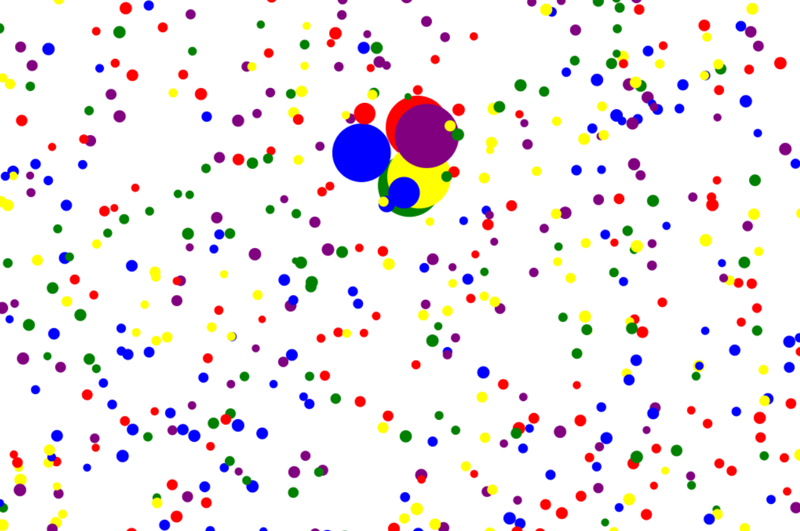

# Hovering-Bubbles-Animation-using-Canvas-HTML-JavaScript

   <h1>Hovering Bubbles Animation Repository Description</h1>
    
   
The Hovering Bubbles Animation repository hosts an engaging HTML5 canvas project that brings to life a dynamic and interactive display of bubbles. Leveraging JavaScript and HTML5 Canvas, this project offers users a captivating experience as they hover over the bubbles, witnessing them expand gracefully within a constrained range.

   

        <h2>Key Features:</h2>
        <ul>
            <li>Interactive Bubbles: Delight in the playful interaction with bubbles that react intuitively to mouse hover actions.</li>
            <li>Smooth Animation: Enjoy smooth transitions as the bubbles elegantly expand and contract within their designated hover range.</li>
            <li>Customizable Parameters: Tailor the animation to your preferences with adjustable parameters for bubble size, hover range, and animation speed.</li>
            <li>Responsive Design: Experience seamless performance across various devices and screen sizes, thanks to the project's responsive design.</li>
            <li>Efficient Rendering: Benefit from optimized rendering techniques, ensuring efficient performance even with a high number of bubbles on the canvas.</li>
        </ul>
    

   

        <h2>How to Use:</h2>
        <ol>
            <li>Clone the Repository: Clone the repository to your local machine using Git.</li>
            <li>Open HTML File: Simply open the HTML file in your preferred web browser to launch the interactive animation.</li>
            <li>Hover over Bubbles: Move your mouse cursor over the bubbles to witness them expand within their predefined range.</li>
            <li>Explore Customization: Feel free to explore the codebase and experiment with different parameters to customize the animation according to your preferences.</li>
        </ol>
    

   

        <h2>Technologies Used:</h2>
        <ul>
            <li>HTML5 Canvas</li>
            <li>JavaScript</li>
        </ul>
    

   

        <h2>Contributing:</h2>
        
Contributions to enhance the functionality, optimize performance, or improve the user experience are warmly welcomed. Please follow the guidelines outlined in the repository to contribute effectively.

    

   

        <h2>License:</h2>
        
This project is licensed under the MIT License. Feel free to use, modify, and distribute the code as per the terms of the license.

    

